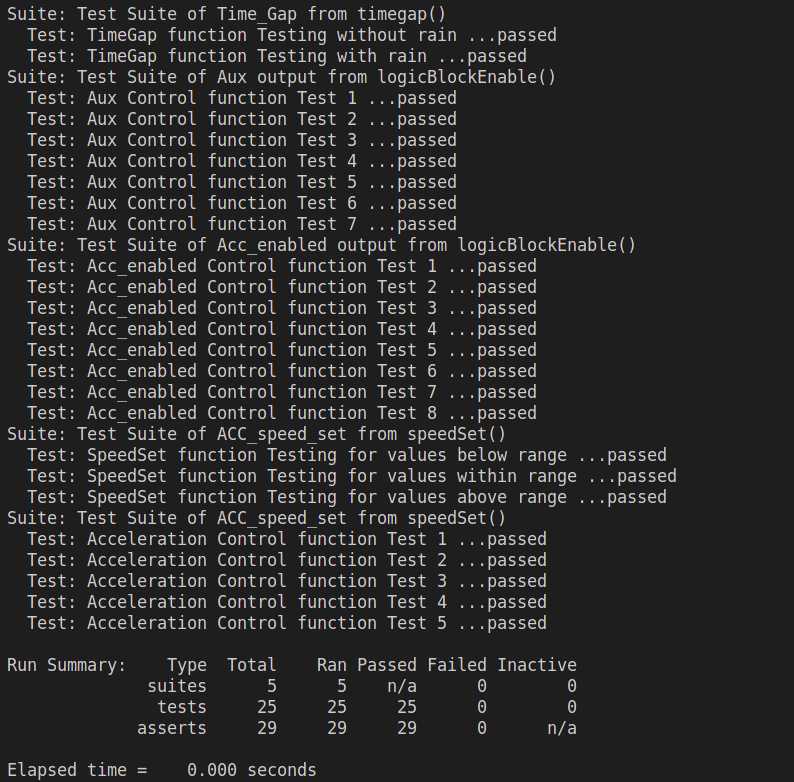
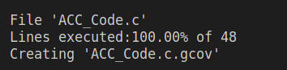

# Adaptative Cruise Control Code

In this repository, we developed the code for our ACC based on the Matlab model and requirements at ACC_Code/ACC/Code.c.
Was also developed some test suites to verify the code operation.

For all compilations to work correctly, the compilation environment must be Linux.

#### 📌  A project using <strong>RTOS</strong> was done too. To check it, clone the follow repository:

```
git clone https://github.com/leonardomello27/RTOS.git
```

## 🚀 First of all, clone this repository to your local machine

```
git clone https://github.com/Mhsp990/ACC_Final_Project_Code.git
```

### 📦 Files

* .github/workflows/c-cpp.yml -> Settings of build GitHub Action 

*  ACC_Code/ 

    gcovr-report -> Folder with the html coverage test report. Open at live sever to check. 

    output -> Folder with binary and .txt from SimulationACC_Code.c compilation. 

    ACC_Code.c -> Main code of project with all functions model. 

    ACC_Code.h -> Header of ACC_Code.c. 

    main -> Executable from suits tests cases of Test_ACC.c 

    Makefile -> File with commands to be run. 

    SimulationACC_Code.c -> Code of simulation to run ACC_Code.c. It's the file to generate datalog .txt. 

    Test_ACC.C -> Test code of all functions at ACC_Code.c in CUnit. 

    .gcda .gcno .o -> Files generated of test and coverage. 

### 🖺 Documentation

To access the documentation, simply access the Docs folder and execute the docs.bat file (Windows) or docs.sh(Linux).
It is a shortcut to the documentation HTML generated by Doxygen in the Docs/html/index.html directory.

### 📋 Prerequisites

* GCC compiler
* CUnit unit tester
* GCOV test coverage
* GCOVR coverage report

GCC needs to be installed on your local machine previously and than you can use the 
makefile to install all the necessary freeworks to run Test, coverage and report.

###  ⚙️ Compile and simulate the ACC

To simulate the ACC operation, go to SimulationACC_Code.c and compile! 

The compilation response are a .txt and a binary files that was created at output folder.
The SimulationACC_Code.txt has the following data:

Acceleration, SafeDistance, RelativeDistance, EgoVelocity and LeadVelocity. 

* Acceleration: The main output. Indicates to Ego car to break or accelerate.
* SafeDistance: The distance that Ego car needs to respect according to speed os both cars.
* RelativeDistance: The real distance of both cars. It must tend to be equal to SafeDistance.
* EgoVelocity: The speed from the ACC car, it need to be equal to Lead car velocity or ACC_speed_set.
* LeadVelocity: The speed of the car in front of Ego car.

### 🔧 Makefile Instructions 

Open linux terminal, enter the <ACC_Code> folder and run the lines code below in order.

* Comand to install CUnit tester

```
make install cunit
```

* Comand to build the tests from Test_ACC.c

```
make build
```

* Run the main file

```
./main
```

And then the tests were generated and executed creating the .gcno, .o and .gcda binaries.
Next we will run the following commands to make coverage and report.

* Comand to build the coverage tests

```
make coverage
```

* Comand to install gcovr and libraries - needs the pip package management

```
make deps
```

* Comand that generate html file at gcovr-report folder

```
make gcovr-report
```

### 🔩 Analyze tests end-to-end

After compiled all comands above, we have the following results:

#### Tests:


### Coverage:


### Gcov report:
[Html report](http://127.0.0.1:5500/ACC_Code/gcovr-report/coverage.ACC_Code.c.html)

## ✒️ Autores

* **Gabriel Oliveira** -  [github profile](https://github.com/sironark)
* **Matheus Passos** - [github profile](https://github.com/Mhsp990)
* **Leonardo Mello** - [github profile](https://github.com/leonardomello27)
* **Lucas Sobral** - [github profile](https://github.com/lucasbral)
* **Vitor Fassanaro** - [github profile](https://github.com/vitorfccarvalho)


